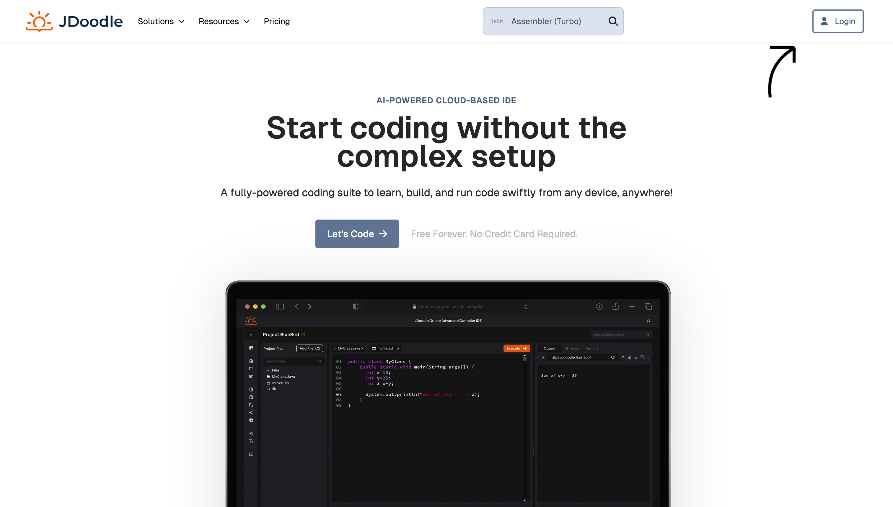
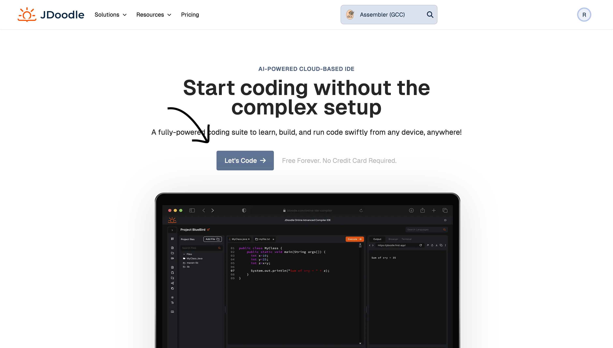
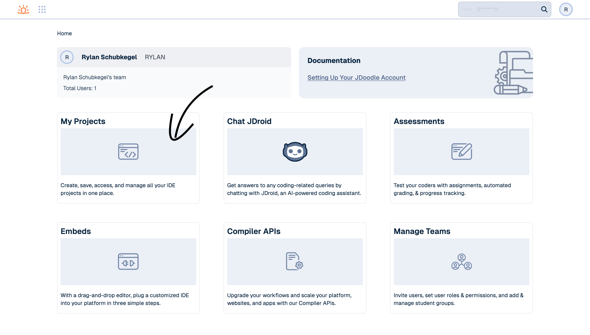
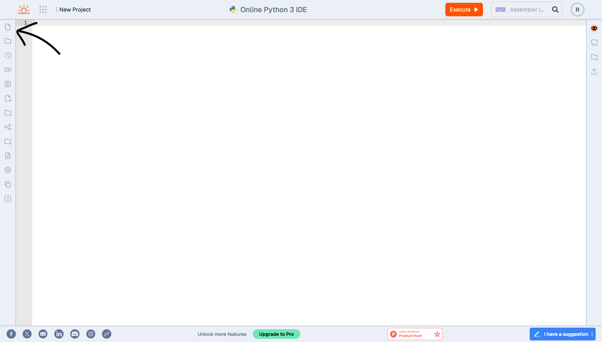
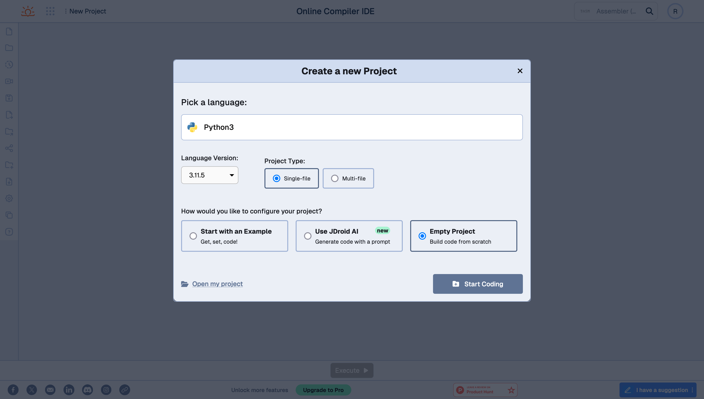
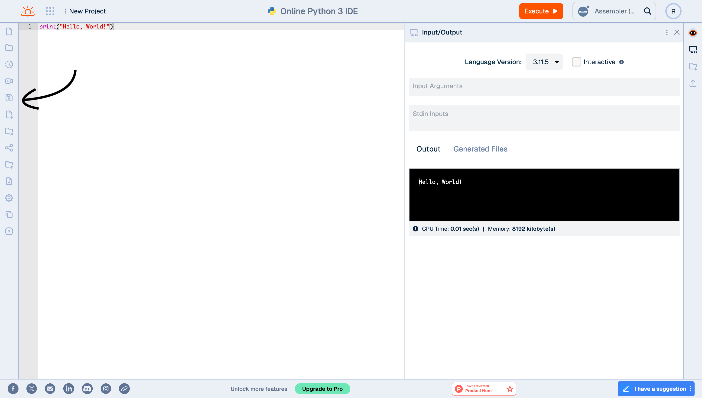
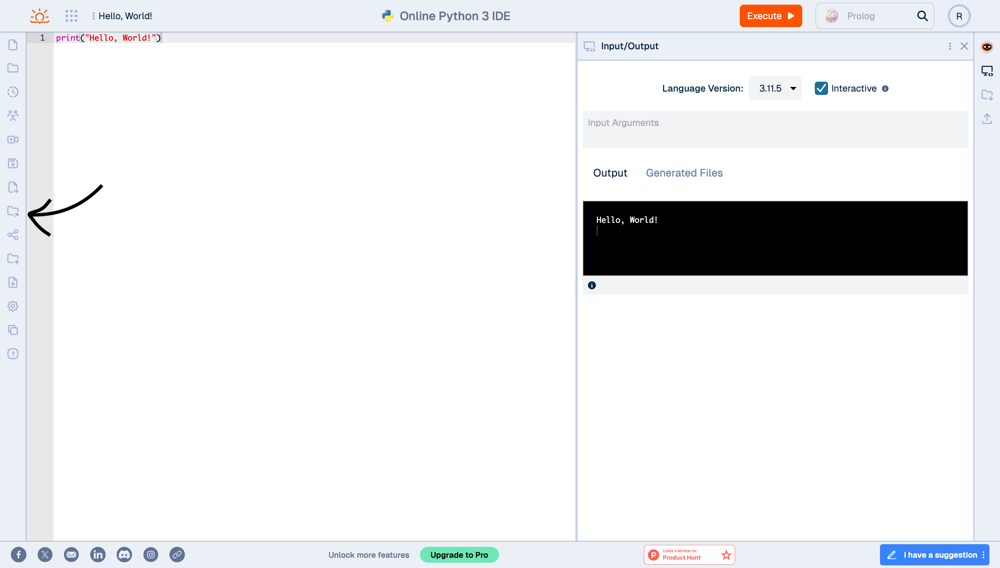

← [Course Homepage](/2024/fall/computer-science)

# Hello, World!

<mark>Due 09/17 at 11:59</mark>

A classic first program to test that your toolchain (runtime environment, compiler, <abbr title="integrated development environment">IDE</abbr>, etc.) is set up properly is the "Hello, World!" program.

> ...the tradition of using the phrase "Hello, World!" as a test message was influenced by an example program in the 1978 book The C Programming Language...

See [Wikipedia page](https://en.wikipedia.org/wiki/%22Hello,_World!%22_program) to read more about it.

### Step One: Create a JDoodle Account

An integrated development environment (IDE) is a program that provides text editing, syntax highlighting, file explorer, debugging tools, and other things that are useful for coding. For this class, we will use **JDoodle** as our IDE which runs in a web browser and allows you to access your work across multiple computers.

Visit [www.jdoodle.com](https://www.jdoodle.com/) and set up an account. I recommend using your student Gmail account so you don't have to remember another password.



### Step Two: Create a New Python Project

There are several ways to create a new project, a few examples are shown below.

<figure>



<figcaption>From the landing page</figcaption>

</figure>

<figure>



<figcaption>From dashboard</figcaption>

</figure>

<figure>



<figcaption>From editor</figcaption>

</figure>

When you find a button that allows you to create a new project, make sure the project settings match what is listed below.



### Step Three: Print "Hello, World!"

Type the following code in your editor and press the "Execute" button at the top right of the screen. You should see an "Input/Output" window appear with the text "Hello, World!" in the terminal.

```python
print("Hello, World!")
```

> The term "printing" in computer programming originates from the early days of computing, when output was often produced on physical printers. In the 1950s and 1960s, computers used line printers, which printed output on paper, line by line. Programmers would write code to "print" output to the printer, which would then produce a physical printout of the results.

### Step Four: Save Your Project

Press the save icon, give your project a descriptive name, and press "Save." Make sure to save often when you are working!



> The save icon, often represented by a [floppy disk](https://en.wikipedia.org/wiki/Floppy_disk), has its origins in the early days of personal computing. The floppy disk was a common storage device used to save and transfer files in the 1970s and 1980s.
> 
> The save icon exemplifies a type of design known as "skeuomorphism" where an image represents and older, typically physical, version of the thing it represents. You can see this in other other common icons such as a trash bin representing a "delete" operation or a paper airplane representing the "send message" action. What other examples of skeumorphism can you think of?

### Step Five: Experiment

You can do a lot by just printing to the terminal! Here are some ideas to get started:

- Use multiple `print()` statements
- Try printing with the special characters `\t` and `\n`
- See if you can make some simple [ASCII art](https://en.wikipedia.org/wiki/ASCII_art)

### Step Six: Turn it In

To turn in your project, press the "Editable Share" button.



When prompted, confirm that you want to share this project. You will see a link that starts with "Share URL" -- click this link to copy it to your clipboard. Finally, paste this link in a new email to me with the title "Hello World" or something similar.

That's it! You've completed your first assignment 🎉