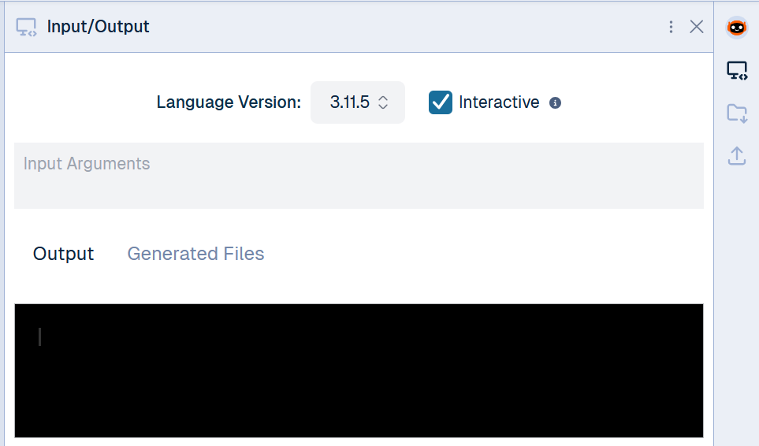

← [Course Homepage](/2024/fall/computer-science)

# Make a Quiz

<mark>Due 09/17 at 11:59</mark>

Make a quiz about something you're passionate about! Sports, music, games... the sky is the limit. Your quiz should follow these specifications:

- Includes <abbr title="10 in binary">1010</abbr> 😉 or more questions
- Tells the user if they were right or wrong after each question
- Gives the user a score at the end

You will use the `print()` and `input()` functions we talked about in class, as well as some new concepts:

- Tracking score in a numeric **variable**
- Write **conditions** to run different code based on user input

Here are some resources to learn about these new concepts:

- **Variables**
  - 📖 [Variables in Python](https://www.pythontutorial.net/python-basics/python-variables/)
  - 📽️ [Python Variables](https://www.youtube.com/watch?v=Gf9wLsCJDqc)
  - NOTE: you can _add_ to an existing number variable like this:
    ```py
    x = 0
    x = x + 1
    ```
- **Conditions**
  - 📖 [Python Conditions](https://www.w3schools.com/python/python_conditions.asp)
  - 📽️ [Control Flow in Python](https://youtu.be/Zp5MuPOtsSY?si=aan38X8g9lOzrFFl)

<p class="notice">
  Remember: to make your JDoodle terminal interactive, toggle the "Interactive" checkbox in the "Input/Output" tab.

  

</p>

When you've finished, have a friend or family member try out the quiz! When you're happy with it, you can submit your assignment here:

<p style="text-align:center"><a href="https://docs.google.com/forms/d/e/1FAIpQLSdtJ1ThnHvtmuJXIHTh71-ozI0ViKHhVT9aUo2u_EOuPUwR_g/viewform?usp=sf_link" class="button">Submit Assignment</a></p>